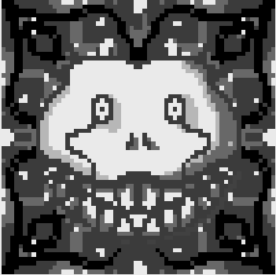
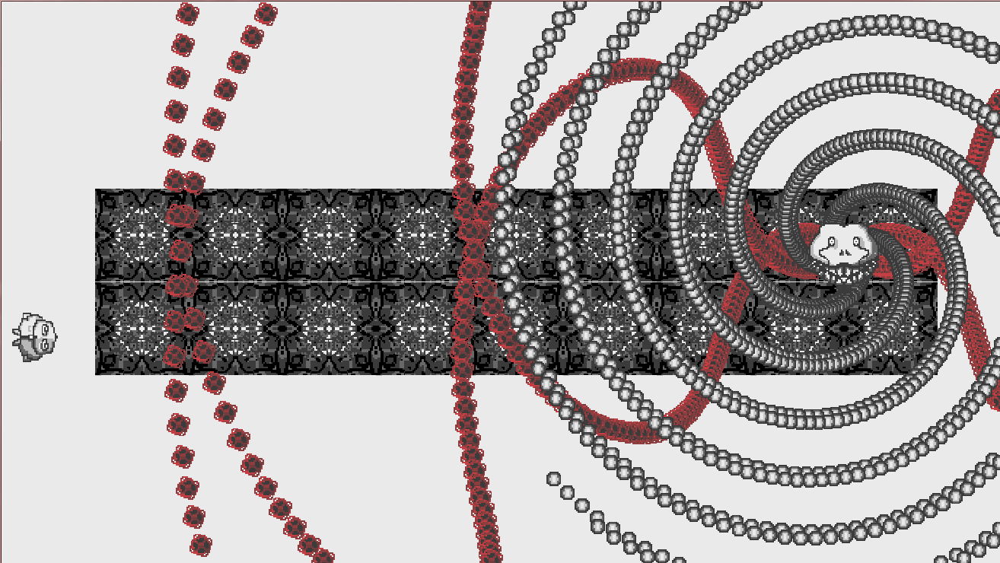
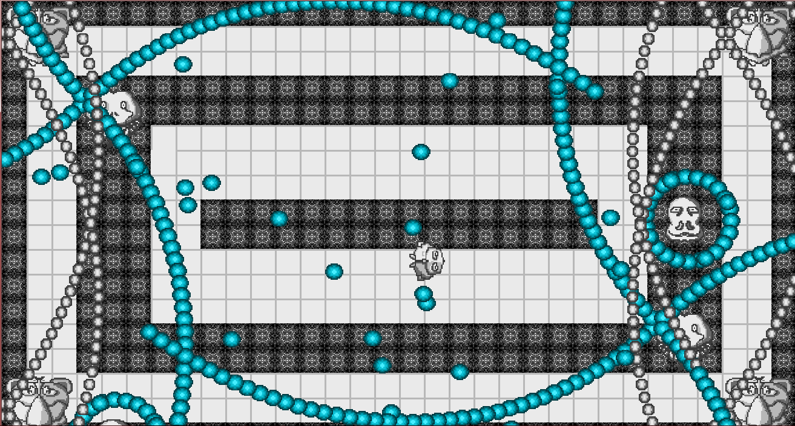

# Projet LostCost Version V0.6


`Genre :` Shoot Em UP / Die ANd Retry/ BOSS GAME
`Joueurs :` 1 à 2 joueur
`Support :` PC,MOBILE
`Cible :` adepte des vieux Shoot Em up, des hardCoreGamer
`Environnement de dev :` Game Maker GML langage
FirstShoot a pour but principal de nous permettres la prise en main du logiciel gameMakerV2.
Il permettra aussi la répartition de tâches et le travail de groupe. 


### BackGround / Concept
La reproduction des codes bien connu des années 80 avec les jeux de shootemUp(SEU) comme dondonpachi et autres et au coeur du jeux. A l'époque le controle ce fesait avec un joystique ce qui n'étais pas des plus prècis il fallait donc abaisser le niveau du jeux au controleurs. Grace à la précision des souris et du tactile nous comptons monté le niveau de difficulté à son parocsimme pour ce genre.


### GamePlay


il reprendra les bases des SEM mais sera constitué en grande partie de boss. Il est important d'appuyer sur l'unicité de chacun autant pour son gameplay que par son caractère et design.
Le jeux sera en 2d vue aérien. Le joueur incarnera le heros du jeux qui aura à son équipement 3 modes de tirs.
 Ainsi que des bombes limité dans son inventaire qui permettrons la supression de toutes les bullets à l'écran
 et d'un nombre de vie de 3. Si le joueur atteint 3 mort il sera invité à insérer un jeton qui lui retira des points de score. 
 Le but et donc de survivre au différent niveaux.
 Chaque niveau peut avoir un objectif different.
 tuez le boss,survivre à un chrono, atteindre un score. 
 Un score sera établie pour chaque partie et dépendra des performance divers du joeurs. 
> temps pour conclure le niveau
> Mort du joueur
> distance du boss lors des tirs
Le score et un element principale du gameplay chaque score sera comparé au autres joueur sur un classement 


 Controle du jeux.


### Design 
Le design n'étant pas le corp du jeux et n'ayant pas de gameDEsigner/levelDesigner a plein temps les concept seront très secondaires.
Un aspect Pixelisé à été choisi avec 3 nuance gris-blanc-noir.
Seul les bullets/tirs seront coloré pour une meilleur lisibilité de l'écran

### Univers


```HTML
<HEAD>Update for Version 0.5</HEAD>
<p title="Objectif 10"> Creer un système procédural pour le spawn Enemie. //première étape de la génération procédurale des niveaux</p> 
<p title="Objectif 10.5">Creation de room en % pour adapter l'affichage à chaque écran </p> 
<p  title="Objectif 11"> Changer les Inputs keyboard vers input souris pour passer sur 
tactile.  Modifier les animations liez au inputs </p>   
<p  title="Objectif 12"> Optimiser Code. Créer une  classe Mère Pour les Enemies et bullets<!--redondance -->


<HEAD>Update for Version 0.6</HEAD>
<p title="Objectif 13"> Creation d'un menu de sélection de niveaux</p> 
<p title="Objectif 14"> Création des prémisse Creation d'une interface de type borne arcade année 80 //Ajout Font Pixel</p>
<p title="Objectif 15" Type=  "Secondaire" >Mise a l'echelle de tous les éléments</p>

</p>
```